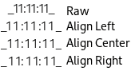
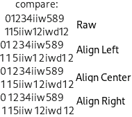
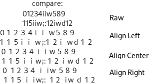

# Convert font characters to monospace

To get all* characters have the same width (*= depends on your test-text-string).
This is more or less a draft and just as example. It's may contain memory leaks or other problems.
Primary it was written to convert only the digits for a clock.

Technologie: GTK , Pango , C

Requirement: install the font "Cantarell Regular"

This are two example, how realise this modification of the font:

## Versions:

 - only convert the digits to monospace (e.g. for a clock):

   

   
   
   Source: [force_monospace_digits-only_v2.c](force_monospace_digits-only_v2.c)

   Source: [force_monospace_digits-only_v3.c](force_monospace_digits-only_v3.c)

 - convert all ( / or only a-Z0-9) character to the supposed* mostly same width (*= depends on your test-text-string)
 
   

   Source: [force_monospace_abc123_v3.c](force_monospace_abc123_v3.c)

## How this works:

### Step 1: init & detect if modification is need

   - write a test-text-string (e.g. digits 0123456789) in a invisible test-label.
   - compare the width of all these digits:
     - when different, a process will be needed. => save this as TRUE
     - save the PangoGlyph ID of each single digit.
     - save biggest width of the test-text-string ( => variable maximal ).
     
### Step 2: process

   - when processing is needed (TRUE):
     - loop each character and check all the character, which need to be modified:
       - Do this by compare the PangoGlyph ID with the stored list from step before.
       - Then: change each single selected Glpyh:
          - `width = max_possible_width_of_digits` , and
          - `x_offset += ( max_possible_width_of_digits - width )` (This will align it to the right).

date: 2026-04-29
